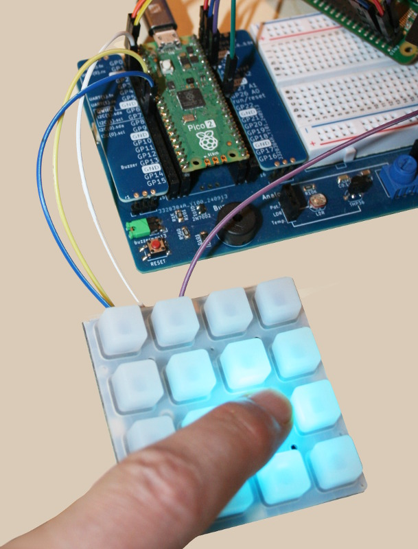
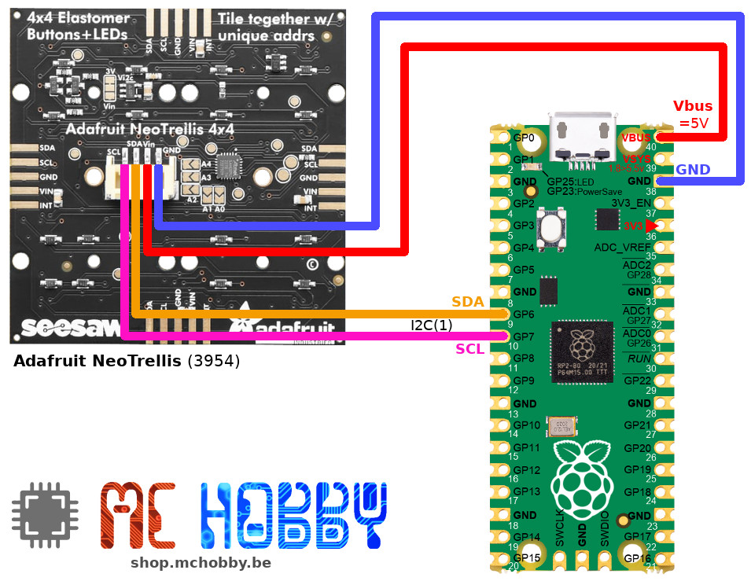

# Adafruit NeoTrellis under MicroPython

This repository is an attempt to make Adafruit CircuitPython NeoTrellis compatible with MicroPython.

The image below shows the Adafruit NeoTrellis, an Adafruit product propelled by SeeSaw on SAMD09.



This MicroPython version of NeoTrellis follows the [Hardware Agnostic approch used in the esp8266-upy library collection](https://github.com/mchobby/esp8266-upy) .

Thanks to the __Plateform Agnostic Approach__ this library should work with any MicroPython boards.

## Credit

[NeoTrellis is brand from Adafruit Industries](https://www.adafruit.com/search?q=neotrellis) is designed to work with CircuitPython, Wiring (Arduino) and Python.

This repository is based on [Adafruit Seesaw for CircuitPython](https://github.com/adafruit/Adafruit_CircuitPython_seesaw/blob/main/adafruit_seesaw/seesaw.py) (_GitHub, AdaFruit, English_).

## Documentation

The original [NeoTrellis documentation](https://github.com/adafruit/Adafruit_CircuitPython_NeoTrellis/tree/main) can be used with few changes.

## MIT License 

The MIT license applied in the CircuitPython library also applies to MicroPython portage.
See the `[LICENSE](LICENSE)` file.

# Library

The library must be copied on the MicroPython board before using the examples.

On a WiFi capable plateform:

```
>>> import mip
>>> mip.install("github:mchobby/micropython-seesaw")
>>> mip.install("github:mchobby/micropython-neotrellis")
```

Or via the mpremote utility :

```
mpremote mip install github:mchobby/micropython-seesaw
mpremote mip install github:mchobby/micropython-neotrellis
```
## Dependencies

The NeoTrellis library requires the [micropython-seesaw](https://github.com/mchobby/micropython-seesaw) to be installed (see the `mpremote` instructions here above).

## About install.sh

The `install.sh` bash script is used to quickly copy the seesaw library (under test) from the computer to the micropython board.

Its main usage concerns code/script testing.

# Wiring

## NeoTrellis to Pico

The Raspberry-Pi Pico can be wired to the NeoTrellis either via a [JST-PH4 connector](https://shop.mchobby.be/product.php?id_product=2638), a [JST-PH4 cable](https://shop.mchobby.be/product.php?id_product=2796), either direct connection on the NeoTrellis solder pads.



# Testing 

The examples are adapted from CircuitPython examples.

* [simpletest.py](examples/simpletest.py) example show how control the pixels and detects button event __on a single NeoTrellis__.

See the [VIDEO of simpletest.py](https://youtu.be/X97S21PTyt4) in action.

# Ressources
* [Adafruit NeoTrellis for CircuitPython](https://github.com/adafruit/Adafruit_CircuitPython_NeoTrellis/blob/main/adafruit_neotrellis/neotrellis.py) (_GitHub, AdaFruit, English_)
* [Adafruit NeoTrellis API](https://docs.circuitpython.org/projects/neotrellis/en/latest/api.html) (_readthedocs, Adafruit, English_)
